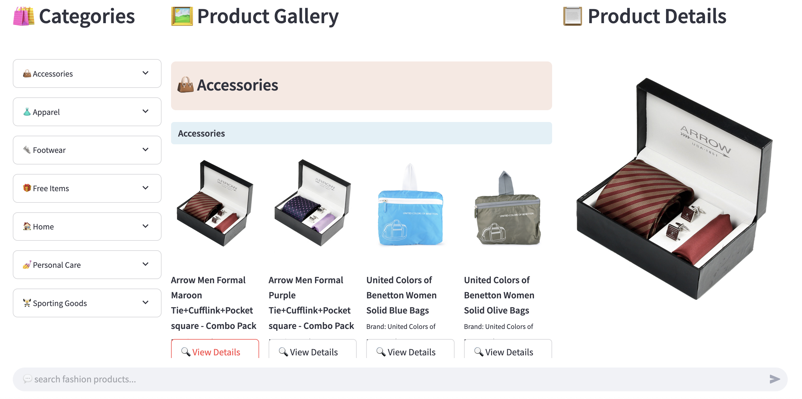

# 🧠 RAG Fashion Recommendation System

An AI-powered fashion recommendation system that enables users to search for products using plain natural language. Built using Retrieval-Augmented Generation (RAG), semantic embeddings, and large language models — this system transforms raw metadata into searchable intelligence.


## 🚀 Features

- 💬 **Natural Language Search** — Users can type full queries like “white cotton t-shirts for summer under ¥1000.”
- 🧠 **LLM-Powered Re-Ranking** — Results are re-ordered using Groq + LLaMA 3 via LangChain for deeper relevance.
- 🧾 **Rich Metadata Processing** — Combines HTML cleaning, paragraph generation, and semantic embedding.
- 🖼️ **Streamlit UI** — Clean interface with category sidebar, product gallery, detail viewer, and chat bar.
- 🔍 **Hybrid Search Ready** — Leverages ChromaDB for efficient vector similarity retrieval with optional filters.


## 🧰 Tech Stack

- **Frontend**: Streamlit
- **Embedding Model**: BAAI/bge-base-en-v1.5
- **LLM for Reasoning**: Groq + LLaMA 3 (via LangChain)
- **Vector Database**: ChromaDB
- **Prompt Management**: Custom `.txt` prompt templates
- **Data Source**: [Fashion Product Images (Small)](https://www.kaggle.com/datasets/paramaggarwal/fashion-product-images-small)


## ⚙️ Setup

1. **Clone the repository**

```bash
git clone https://github.com/shafiqul-islam-sumon/rag-fashion-recommendation.git
cd rag-fashion-recommendation
```

2. **Create a virtual environment**

```bash
python3.12 -m venv venv
source venv/bin/activate  # or venv\Scripts\activate on Windows
```

3. **Install dependencies**

```bash
pip install -r requirements.txt
```

4. **Set your GROQ API key**

Create a `.env` file in the root directory:

```env
GROQ_API_KEY=your_groq_api_key_here
```

5. **Run the app**

```bash
streamlit run web_app.py
```

Then open http://localhost:8501 in your browser.


## 🖼️ Web UI Preview




## 📁 Project Structure

```
rag-fashion-recommendation/
├── chroma_store/                ← Persisted vector DB (auto-generated)
├── data/                        ← Raw metadata and CSV files
│   ├── metadata/                ← JSON metadata files (1 per product)
│   ├── styles.csv               ← Style-level metadata (brand, color, etc.)
│   └── images.csv               ← Image URL and filename mapping
├── prompt/                      ← Prompt templates for LLM
│   ├── html_prompt.txt
│   ├── paragraph_prompt.txt
│   └── rerank_prompt.txt
├── utils/                       ← Utility modules
│   ├── category.py              ← Hardcoded category/sub-category tree with icons
│   └── metadata_fields.py       ← Metadata display field definitions
├── config.py                    ← All global paths, constants, and model settings
├── data_embedder.py            ← Embeds metadata and stores it in ChromaDB
├── data_retriever.py           ← Retrieves relevant products based on user queries
├── metadata_extractor.py       ← Cleans and parses metadata from JSON & CSV
├── re_ranker.py                ← Re-ranks initial search results using LLM
├── vector_db.py                ← ChromaDB wrapper for insert/query/export
├── web_app.py                  ← Streamlit-based frontend UI
├── requirements.txt            ← Python dependencies
├── .env                        ← API keys and environment variables
└── README.md                   ← Project documentation
```


## 🧪 Example Query

> “Show me red casual dresses for summer under ¥3000.”

✔️ Matches red dresses tagged as casual  
✔️ Filters by season and price  
✔️ Re-ranked to prioritize intent over keyword match


## 📘 Learn More

- Blog Post: [https://shafiqulai.github.io/blogs/blog_7.html](https://shafiqulai.github.io/blogs/blog_7.html)  
- Live App: [https://huggingface.co/spaces/shafiqul1357/rag-fashion-recommendation](https://huggingface.co/spaces/shafiqul1357/rag-fashion-recommendation)
